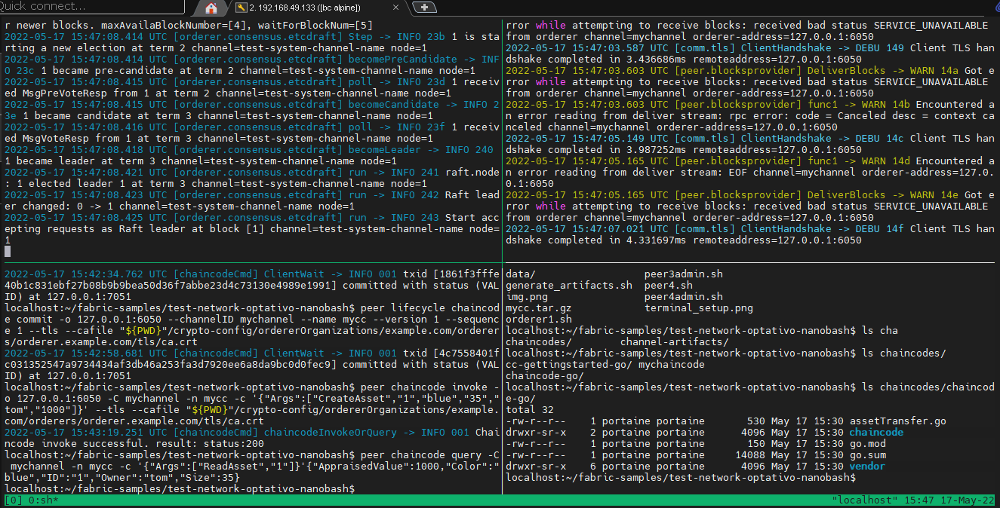

# Fabric Nano bash
# _2 ORG + 1 PEER por org + 1 ORDERER_

Basado en https://github.com/hyperledger/fabric-samples/test-network-nano-bash

Esta red proporciona un conjunto de scripts bash mínimos para ejecutar una red Fabric en su máquina local.
La red es funcionalmente equivalente a la red de prueba basada en Docker, por lo tanto, puede ejecutar todos los tutoriales y muestras que apuntan a la red de prueba con cambios mínimos.
Se utilizan los binarios de Fabric en lugar de usar contenedores Docker. Y el chaincode se ejecuta  en un contenedor.

Los scripts brindan una configuración mínima para una red Fabric y, al mismo tiempo, ofrecen una red habilitada para TLS de múltiples nodos:
- 1 nodo-ordenador
- Configuración mínima para un canal con (1 nodo-ordenador) y 2 organizaciones (con 1 nodo-par cada una)
- Política de respaldo mínimo para permitir que 1 organización respalde (aprobar y confirmar) un chaincode

# Requisitos previos

- Siga la documentación de Fabric para los [Requisitos previos] (https://hyperledger-fabric.readthedocs.io/en/release-2.2/prereqs.html)
- Siga la documentación de Fabric para [descargar el fabric-samples y los binarios de Fabric] (https://hyperledger-fabric.readthedocs.io/en/release-2.2/install.html). Puede omitir las descargas de imágenes de Docker usando `curl -sSL https://bit.ly/2ysbOFE | bash -s -- -d`

# Instrucciones para iniciar la red

Abra ventanas de terminal para 1 nodo-ordenador, 2 nodos-pares y 2 administradores de pares como se ve en la siguiente configuración de terminal. El primer nodo-par y administrador pertenece a Org1, el último nodo-par y administrador pertenece a Org2.
Puede comenzar con una única organización y la administración de su nodo-par.


Las siguientes instrucciones le permiten ejecutar scripts bash que establecen variables de entorno para un componente y luego ejecuta el componente.
Los scripts contienen solo comandos simples para que sean fáciles de comprender.

- cd al directorio `test-network-optativo-nanobash` en cada ventana de terminal
- En el terminal del nodo-ordenador, ejecute `./generate_artifacts.sh` para generar transacciones de configuración y bloques de génesis del canal y del sistema (llamadas a configtxgen). Los artefactos se crearán en los directorios `crypto-config` y `channel-artifacts`.
- Luego en esa misma terminal, ejecute `./orderer1.sh`
- En las dos terminales para nodos-pares, ejecute `./peer1.sh`, `./peer2.sh` respectivamente
- Tenga en cuenta que el nodo-ordenador y los nodo-pares escriben sus datos (incluidos sus ledger) en su propio subdirectorio en el directorio "datos".
- En las terminales para administración de nodos-pares, ejecute `source peer1admin.sh`, `source peer2admin.sh` respectivamente

Los scripts de administración de nodos-pares se ejecutan con el comando `source` para cargar las variables de entorno en los respectivos shells. Esto es importante para que las variables de entorno exportadas puedan ser utilizadas por cualquier comando posterior.

El script `peer1admin.sh` establece las variables de entorno de administración de peer1, crea el canal de la aplicación `mychannel`, actualiza la configuración del canal para el anchor-peer de org1 y une el peer1 al canal `mychannel`.
El scripts de administración de el nodo-par restante une el otro nodo-par al canal `mychannel`.

# Instrucciones para implementar y ejecutar el chaincode "chaincode-go" de ejemplo

## requisitos previos
Antes debe tener las imagenes docker de fabric-ccenv y fabric-baseos:

### Pull ccenv

```bash
$ docker pull hyperledger/fabric-ccenv:2.2.5
$ docker tag hyperledger/fabric-ccenv:2.2.5 hyperledger/fabric-ccenv:2.2
```

### Pull baseos

```bash
$ docker pull hyperledger/fabric-baseos:2.2.5
$ docker tag hyperledger/fabric-baseos:2.2.5 hyperledger/fabric-baseos:2.2
```

## Descargando dependencias del chaincode
```go
// we move to the chaincode directory (ex: cd chaincodes/chaincode-go/)
cd chaincodes/chaincode-go

go mod vendor
```

Para implementar e invocar el chaincode, utilice el terminal de administración peer1 que creó en los pasos anteriores:

```
source peeradmin.sh
```

## Empaquete e instale el chaincode en el peer1:

```
peer lifecycle chaincode package mycc.tar.gz --path ./chaincodes/chaincode-go --lang golang --label mycc

peer lifecycle chaincode install mycc.tar.gz
```

La instalación del chaincode puede demorar un minuto

Copie el ID del paquete de chaincode devuelto en la variable de entorno para usar luego (el ID puede ser diferente):

```
export CHAINCODE_ID=mycc:faaa38f2fc913c8344986a7d1617d21f6c97bc8d85ee0a489c90020cd57af4a5
```

Antes de proceder compruebe que la variable de entorno:

```
echo $CHAINCODE_ID
```
Debe dar como salida el ID de chaincode

## Activar el chaincode
Con el script `cc_approve_commit.sh` se aprueba y confirma el chaincode (solo es necesaria una única aprobación según la política de validación definida):
Puede usar el script `cc_approve_commit.sh` o ejecutar los comando de manera manual, como desee.

Usando el script:
```
./cc_approve_commit.sh
```

La forma manual:
```
peer lifecycle chaincode approveformyorg -o 127.0.0.1:7050 --channelID mychannel --name mycc --version 1 --package-id $CHAINCODE_ID --sequence 1 --tls --cafile "${PWD}"/crypto-config/organizations/org1.example.com/peers/peer0.org1.example.com/tls/ca.crt

peer lifecycle chaincode commit -o 127.0.0.1:7050 --channelID mychannel --name mycc --version 1 --sequence 1 --tls --cafile "${PWD}"/crypto-config/organizations/org1.example.com/peers/peer0.org1.example.com/tls/ca.crt
```

## Interactuar con el chaincode

Invoque el chaincode para crear un activo (en esta red solo se requiere que una única Org valide la Tx según la política de respaldo configurada).
Luego consulte el activo, actualícelo y vuelva a consultar para ver los cambios de activos resultantes en el ledger. Tenga en cuenta que debe esperar un poco para que se completen las transacciones de invocación.
```
peer chaincode invoke -o 127.0.0.1:7050 -C mychannel -n mycc -c '{"Args":["CreateAsset","1","blue","35","tom","1000"]}' --tls --cafile "${PWD}"/crypto-config/organizations/org1.example.com/peers/peer0.org1.example.com/tls/ca.crt

peer chaincode query -C mychannel -n mycc -c '{"Args":["ReadAsset","1"]}'

peer chaincode invoke -o 127.0.0.1:7050 -C mychannel -n mycc -c '{"Args":["UpdateAsset","1","blue","35","jerry","1000"]}' --tls --cafile "${PWD}"/crypto-config/organizations/org1.example.com/peers/peer0.org1.example.com/tls/ca.crt

peer chaincode query -C mychannel -n mycc -c '{"Args":["ReadAsset","1"]}'
```

¡Felicitaciones, ha implementado una red Fabric mínima! Inspeccione los scripts si desea ver el conjunto mínimo de comandos necesarios para implementar la red.

Utilice `Ctrl-C` en las ventanas del terminal para eliminar los procesos de los nodos. Puede ejecutar los scripts nuevamente para reiniciar los componentes con sus datos existentes, o ejecutar `./generate_artifacts` nuevamente para limpiar los artefactos y datos existentes si desea reiniciar con un entorno limpio.
